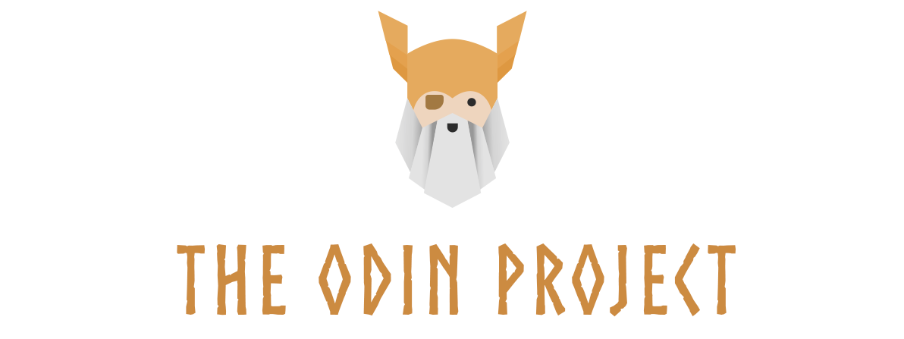

<a id="readme-top"></a>

[![Contributors][contributors-shield]][contributors-url]
[![Forks][forks-shield]][forks-url]
[![Stargazers][stars-shield]][stars-url]
[![Issues][issues-shield]][issues-url]
[![project_license][license-shield]][license-url]
[![LinkedIn][linkedin-shield]][linkedin-url]

<!-- PROJECT LOGO -->
<br />
<div align="center">
  <a href="https://github.com/ayemteezy/odin-landing-page">
    
  </a>

<h3 align="center">Odin Landing Page</h3>

  <p align="center">
    A visually precise landing page website built from scratch using semantic HTML and CSS Flexbox for The Odin Project curriculum.
    <br />
    <a href="https://github.com/ayemteezy/odin-landing-page"><strong>Explore the docs »</strong></a>
    <br />
    <br />
    <a href="https://ayemteezy.github.io/odin-landing-page/">View Demo</a>
    &middot;
    <a href="https://github.com/ayemteezy/odin-landing-page/issues">Report Bug</a>
    &middot;
    <a href="https://github.com/ayemteezy/odin-landing-page/issues">Request Feature</a>
  </p>
</div>

<!-- TABLE OF CONTENTS -->
<details>
  <summary>Table of Contents</summary>
  <ol>
    <li>
      <a href="#about-the-project">About The Project</a>
      <ul>
        <li><a href="#built-with">Built With</a></li>
      </ul>
    </li>
    <li>
      <a href="#getting-started">Getting Started</a>
      <ul>
        <li><a href="#prerequisites">Prerequisites</a></li>
        <li><a href="#installation">Installation</a></li>
      </ul>
    </li>
    <li><a href="#usage">Usage</a></li>
    <li><a href="#roadmap">Roadmap</a></li>
    <li><a href="#contributing">Contributing</a></li>
    <li><a href="#license">License</a></li>
    <li><a href="#contact">Contact</a></li>
    <li><a href="#acknowledgments">Acknowledgments</a></li>
  </ol>
</details>

<!-- ABOUT THE PROJECT -->

## About The Project

[![Odin Landing Page Screen Shot][product-screenshot]](images/full-design.png)

This project is a webpage built to demonstrate foundational layout and design skills using HTML and CSS. The goal of this assignment from The Odin Project's Foundations course is to take a strict design specification and translate it into a beautiful, well-structured webpage using flexbox layouts.

Key elements practiced in this project:

- Translating a static visual design concept into semantic HTML structure
- Utilizing CSS Flexbox for complex alignment, direction, wrapping, and spacing
- Managing text colors, high/low contrast variations, and font weight hierarchies
- Styling customized modern web elements like hero layouts, card grids, quotes, and action banners

<p align="right">(<a href="#readme-top">back to top</a>)</p>

### Built With

- [![HTML5][HTML.com]][HTML-url]
- [![CSS3][CSS.com]][CSS-url]

<p align="right">(<a href="#readme-top">back to top</a>)</p>

<!-- GETTING STARTED -->

## Getting Started

To view or test this project locally, you only need a web browser—no complex setup required.

### Prerequisites

You only need a modern web browser (like Chrome, Firefox, Safari, or Edge) and a text editor if you want to inspect or modify the code.

### Installation

1. Clone the repo
   ```sh
   git clone https://github.com/ayemteezy/odin-landing-page.git
   ```
2. Open the directory
   ```sh
   cd odin-landing-page
   ```
3. Open `index.html` in your web browser to view the page locally.

<p align="right">(<a href="#readme-top">back to top</a>)</p>

<!-- USAGE EXAMPLES -->

## Usage

This project showcases a clean business or product landing page structure featuring:

- **Header**: Navigation bar containing user navigation links and logo branding
- **Hero Section**: Catchy header text ("This website is awesome"), supporting subtext, a main Call to Action button, and a prominent image placeholder
- **Information Section**: A cleanly arranged 4-column layout grid featuring product details accompanied by illustrations
- **Quote Banner**: A modern, dark-themed quote layout styling a quote from Thor, God of Thunder
- **Call to Action**: A vibrant action box emphasizing product signups

Feel free to reuse this layout template structure for other web engineering designs or portfolio assignments.

<p align="right">(<a href="#readme-top">back to top</a>)</p>

<!-- ROADMAP -->

## Roadmap

- [x] Establish core semantic HTML architecture
- [x] Configure CSS Flexbox structures for multi-column grids
- [x] Implement precise color matching and typography weight variables
- [x] Deploy live version via GitHub Pages
- [ ] Add smooth-scroll transitions for header menu links
- [ ] Enhance with responsive media queries for optimized mobile viewports

See the [open issues](https://github.com/issues) for a full list of proposed features (and known issues).

<p align="right">(<a href="#readme-top">back to top</a>)</p>

<!-- CONTRIBUTING -->

## Contributing

Contributions are what make the open source community such an amazing place to learn, inspire, and create. Any contributions you make are **greatly appreciated**.

If you have a suggestion that would make this better, please fork the repo and create a pull request. You can also simply open an issue with the tag "enhancement".
Don't forget to give the project a star! Thanks again!

1. Fork the Project
2. Create your Feature Branch (`git checkout -b feature/AmazingFeature`)
3. Commit your Changes (`git commit -m 'Add some AmazingFeature'`)
4. Push to the Branch (`git push origin feature/AmazingFeature`)
5. Open a Pull Request

<p align="right">(<a href="#readme-top">back to top</a>)</p>

### Top contributors:

<a href="https://github.com/ayemteezy/odin-landing-page/graphs/contributors">
  
</a>

<!-- LICENSE -->

## License

Distributed under the MIT License. See `LICENSE` for more information.

<p align="right">(<a href="#readme-top">back to top</a>)</p>

<!-- CONTACT -->

## Contact

Laurence Lester Cariño (Teezy) - [@ayemteezy\_](https://x.com/ayemteezy_) - laurencelestercarino@gmail.com

Profile Link: [https://github.com](https://github.com/ayemteezy)

<p align="right">(<a href="#readme-top">back to top</a>)</p>

<!-- ACKNOWLEDGMENTS -->

## Acknowledgments

- [The Odin Project Foundations Course](https://www.theodinproject.com/paths/foundations/courses/foundations)
- [MDN Web Docs - CSS Flexible Box Layout](https://developer.mozilla.org/en-US/docs/Learn_web_development/Core/CSS_layout/Flexbox)

<p align="right">(<a href="#readme-top">back to top</a>)</p>

<!-- MARKDOWN LINKS & IMAGES -->

[contributors-shield]: https://img.shields.io/github/contributors/ayemteezy/odin-landing-page.svg?style=for-the-badge
[contributors-url]: https://github.com/ayemteezy/odin-landing-page/graphs/contributors
[forks-shield]: https://img.shields.io/github/forks/ayemteezy/odin-landing-page.svg?style=for-the-badge
[forks-url]: http://github.com/ayemteezy/odin-landing-page/forks
[stars-shield]: https://img.shields.io/github/stars/ayemteezy/odin-landing-page.svg?style=for-the-badge
[stars-url]: https://github.com/ayemteezy/odin-landing-page/stargazers
[issues-shield]: https://img.shields.io/github/issues/ayemteezy/odin-landing-page.svg?style=for-the-badge
[issues-url]: https://github.com/ayemteezy/odin-landing-page/issues
[license-shield]: https://img.shields.io/github/license/ayemteezy/odin-landing-page.svg?style=for-the-badge
[license-url]: https://github.com/ayemteezy/odin-landing-page/edit/main/LICENSE
[linkedin-shield]: https://img.shields.io/badge/-LinkedIn-black.svg?style=for-the-badge&logo=linkedin&colorB=555
[linkedin-url]: https://www.linkedin.com/in/laurence-lester-cari%C3%B1o/
[product-screenshot]: images/full-design.png
[HTML.com]: https://img.shields.io/badge/HTML5-E34F26?style=for-the-badge&logo=html5&logoColor=white
[HTML-url]: https://developer.mozilla.org/en-US/docs/Web/HTML
[CSS.com]: https://img.shields.io/badge/CSS3-1572B6?style=for-the-badge&logo=css3&logoColor=white
[CSS-url]: https://developer.mozilla.org/en-US/docs/Web/CSS
